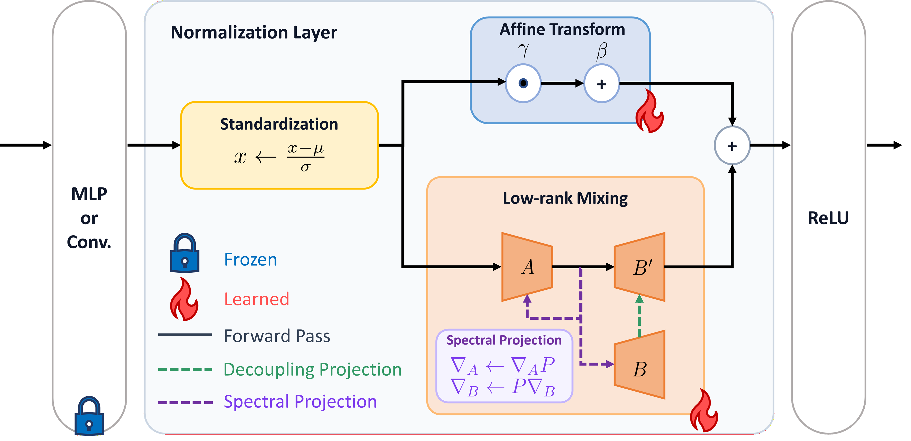

# MixTTA: Low-Rank Cross-Channel Mixing for Reliable Test-Time Adaptation

This is the official repository for **MixTTA**, a lightweight plug-in module that equips
normalization layers with a low-rank **cross-channel** transformation for Test-Time
Adaptation (TTA).

## Overview

Per-channel affine parameters (the only parameters Tent and its follow-ups update)
perform axis-aligned scaling/shifting and are geometrically incapable of correcting the
**cross-channel** structural changes that distribution shift induces. MixTTA adds a
residual low-rank branch `(AB)^T x` to each target normalization layer, enabling
inter-channel mixing while staying parameter-efficient. It is a **model-agnostic plug-in**
that can be attached to any normalization-based TTA method (Tent, EATA, SAR, DeYO, ReCAP).

<p align="center">

</p>

### Key Components

- **Low-Rank Cross-Channel Mixing** (`LoRAFCLinear`): augments the per-channel affine
  transform with a rank-`r` branch (A ∈ ℝ^{C×r}, B ∈ ℝ^{r×C}). B is zero-initialized so
  adaptation starts exactly at the base method (warm start).

- **Decoupling Projection**: projects each row of B onto the orthogonal complement of the
  corresponding column of A, enforcing `diag(AB) = 0`. This keeps the low-rank branch
  purely off-diagonal so it does not duplicate the affine path. Toggled by `--decouple_proj`.

- **Spectral Projection**: projects the low-rank gradients away from the dominant
  eigen-direction of the subspace feature covariance, preventing rank-1 collapse under
  biased / non-stationary streams. Strength is controlled by `--eta`.

## Getting Started

### Requirements

```bash
conda create -n mixtta python=3.9 -y
pip install torch==2.3.1 torchvision==0.18.1 torchaudio==2.3.1 --index-url https://download.pytorch.org/whl/cu118
pip install pycm matplotlib einops timm scikit-learn
```

### Data Preparation

Evaluation is performed on [ImageNet-C](https://github.com/hendrycks/robustness)
(15 corruption types × 5 severities) with ViT-Base (LN) and ResNet-50 (GN).

- Download ImageNet-C from [Zenodo](https://zenodo.org/record/2235448) and set its path
  via `ROOT` (→ `--data_corruption`).
- Provide the clean ImageNet validation set via `DATA` (→ `--data`); it is used only to
  compute the Fisher matrix for EATA.

### Model Weights

- **ViT-Base (LayerNorm)** weights are fetched automatically by `timm` on first run
  (`vit_base_patch16_224.augreg_in21k_ft_in1k`) — no manual download needed.
- **ResNet-50 (GroupNorm)** expects the timm checkpoint at
  `./models/resnet50_gn_a1h2-8fe6c4d0.pth`. Download it once:

  ```python
  import timm, torch
  m = timm.create_model('resnet50_gn', pretrained=True)
  torch.save(m.state_dict(), './models/resnet50_gn_a1h2-8fe6c4d0.pth')
  ```

## Usage

All experiments are launched through **`run_exp.sh`**. Logs are printed to the terminal.

```bash
# Default: ReCAP + MixTTA on ViT-Base, mild scenario
bash run_exp.sh

# Override any variable from the command line
METHOD=tent PLUGIN_MIXTTA=False bash run_exp.sh
MODEL=resnet50_gn_timm EXP=label_shifts bash run_exp.sh
SEED=2023 bash run_exp.sh
DATA=/path/to/imagenet/val ROOT=/path/to/ImageNet-C bash run_exp.sh
```

### LinearTCA (standalone vs. attached)

[LinearTCA](https://github.com/youlj109/TCA) is a correlation-alignment baseline that
can be run in **two** ways:

- **Standalone** — set `METHOD=LinearTCA`. The model runs without adaptation and LinearTCA
  is applied as a post-hoc correction on the collected features.
- **Attached to a base method (`LinearTCA+`)** — keep the base method and set `ADD_TCA=True`.
  The base method (Tent / EATA / SAR / DeYO / ReCAP) adapts as usual, and LinearTCA is then
  applied on top; the reported accuracy is `<METHOD>+LinearTCA`. Following the paper,
  `LinearTCA+` is LinearTCA on the strongest baseline, i.e. `METHOD=recap_plpd ADD_TCA=True`.

```bash
# LinearTCA standalone
METHOD=LinearTCA bash run_exp.sh

# LinearTCA+  (= ReCAP + LinearTCA)
METHOD=recap_plpd ADD_TCA=True bash run_exp.sh
```

> `ADD_TCA` is independent of `PLUGIN_MIXTTA`: MixTTA and LinearTCA are separate correction
> mechanisms and can be toggled independently.

### Arguments

The variables below are `run_exp.sh` overrides; each maps to the corresponding `main.py`
argument shown in parentheses.

#### Core

| Variable (`main.py` arg) | Default | Description |
|---|---|---|
| `METHOD` (`--method`) | `recap_plpd` | Base TTA method: `tent`, `eata`, `sar`, `deyo`, `recap_plpd`, `LinearTCA`, `no_adapt` |
| `MODEL` (`--model`) | `vitbase_timm` | Backbone: `vitbase_timm` (ViT-Base, LayerNorm) or `resnet50_gn_timm` (ResNet-50, GroupNorm) |
| `EXP` (`--exp_type`) | `normal` | Test scenario (see below) |
| `SEED` (`--seed`) | `2024` | Random seed; supported label-shift orders are provided for `2023 / 2024 / 2025` |
| `ADD_TCA` (`--Add_TCA`) | `False` | Attach LinearTCA on top of the base method (`LinearTCA+`); see above |

| `EXP` value | Scenario |
|---|---|
| `normal` | Mild scenario (standard ImageNet-C) |
| `label_shifts` | Online imbalanced label-distribution shift |
| `bs1` | Single-sample adaptation (batch size = 1) |
| `mix_shifts` | All 15 corruption types mixed within each batch |

#### MixTTA plug-in

| Variable (`main.py` arg) | Default | Description |
|---|---|---|
| `PLUGIN_MIXTTA` (`--plugin_mixtta`) | `True` | Enable MixTTA. `False` runs the pure baseline; `True` adds the low-rank branch |
| `LAYER_TYPE` (`--layer_type`) | `LoRAFC` | `LoRAFC` = low-rank cross-channel branch; `FC` = full-rank `W ∈ ℝ^{C×C}` (ablation) |
| `INIT_TYPE` (`--init_type`) | `xavier` | Initialization of A: `xavier`, `orthogonal`, or `kaiming` (B is always zero-init) |
| `R` (`--r`) | `4` | Low-rank subspace dimension `r`. `--alpha` is tied to `R` (effective scale `alpha/r = 1`), so it carries no independent meaning |
| `ETA` (`--eta`) | `0.9` | Spectral Projection strength η ∈ [0, 1]; `0` disables it |
| `DECOUPLE_PROJ` (`--decouple_proj`) | `True` | Enable Decoupling Projection (enforces `diag(AB)=0`) |

#### Target-layer selection

These space-separated lists select which normalization layers the base method updates
(`tent_target_*`) and which receive the MixTTA low-rank branch (`mixtta_target_*`). A
layer is identified by `block` × `layer` × `norm`. Defaults are model-dependent and set
automatically in `run_exp.sh` (ViT: MixTTA on the 2nd norm of the first 5 blocks).

| Variable (`main.py` arg) | ViT default | ResNet default |
|---|---|---|
| `TENT_TARGET_BLOCKS` (`--tent_target_blocks`) | `0 1 2 3 4` | `0 1 2 3` |
| `TENT_TARGET_LAYERS` (`--tent_target_layers`) | `0` | `0 1 2 3 4 5` |
| `TENT_TARGET_NORMS` (`--tent_target_norms`) | `1 2` | `1 2 3 4` |
| `MIXTTA_TARGET_BLOCKS` (`--mixtta_target_blocks`) | `0 1 2 3 4` | `0 1 2` |
| `MIXTTA_TARGET_LAYERS` (`--mixtta_target_layers`) | `0` | `0 1 2 3 4 5` |
| `MIXTTA_TARGET_NORMS` (`--mixtta_target_norms`) | `2` | `1 2 3 4` |

> Base-method hyper-parameters (DeYO/ReCAP/SAR/EATA thresholds, etc.) are fixed to their
> paper values as `main.py` defaults and are not exposed in `run_exp.sh`.

## Integration Guide

MixTTA is implemented in `MixTTA.py` as a standalone module. To add it to your own TTA pipeline:

```python
from MixTTA import get_mixtta_model_optim, get_mixtta_layer_names
from MixTTA import set_record_feature, clear_feature_record, filter_feature_record
from MixTTA import spectral_projection, print_model_stats, clear_logging_stats

# 1. Inject adapters and build optimizer
model, optimizer = get_mixtta_model_optim(model, args)

# 2. Collect layer names for Spectral Projection
mixtta_layer_names = get_mixtta_layer_names(model)

# 3. During each forward-backward step:
set_record_feature(model, record_feature=True)
outputs = model(x)
loss.backward()

# 4. Apply Spectral Projection before optimizer step
spectral_projection(model, optimizer, args, mixtta_layer_names)
clear_feature_record(model)
optimizer.step()
```

## Acknowledgment

This repository is built upon [SAR](https://github.com/mr-eggplant/SAR),
[DeYO](https://github.com/Jhyun17/DeYO), and
[ReCAP](https://openreview.net/forum?id=QwxjjaGBUo). Thanks for their excellent projects.
